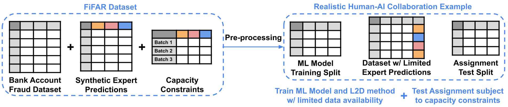

# FiFAR-Seminar

## 1. Installing Necessary Dependencies

### Creating the Python Environment

Requirements:

* Conda3
  
Before using any of the provided code, please create and activate the provided Python environment by running:

    conda env create -f src/fifar-environment.yml
    conda activate fifar-env

Then, please install the package available in the folder [src/Dependencies](src/Dependencies).

    pip install Dependencies/autodefer-0.0.1-py3-none-any.whl

## 2. Preparing the FiFAR Dataset



The dataset is comprised of:

* An Input Dataset.
* Synthetic Expert prediction table.
* Dataset with limited expert predictions.
* Sets of capacity constraint tables.

For more information on each of these components, please consult the provided [datasheet](src/Documents/datasheet.pdf).

### Step 1: Download the Input Dataset

Download the Bank Account Fraud Tabular Dataset, available [here](https://www.kaggle.com/datasets/sgpjesus/bank-account-fraud-dataset-neurips-2022?resource=download&select=Base.csv). This dataset should then be placed in the folder [src/Code/data/](src/Code/data).

### Step 2: Download the Models and FiFAR

The models used in our experiments and the dataset with limited expert predictions are available [here](https://www.kaggle.com/datasets/leonardovalves/fifar-financial-fraud-alert-review-dataset/data). You should place this folder in [src/](src/)

Within the provided folder you will find:

* Expertise Models - Folder containing the models used for deferral
* ML Model - Folder containing the ML model used in the task
* Experts - Folder containing the expert information, including the generated probabilities of error and the resulting predictions
* Testbed - Folder containing the dataset with limited expert predictions and the test capacity constraints

### Step 4: Load data into correct directories

To place all the necessary data in the correct directories, the user needs to run "[src/load\_data.py](src/load_data.py)". The script only requires the user to specify the directory of the datasets downloaded in Step 2. The expert prediction table is split according to the expert preprocessing and deployment splits.

Command here:

```
cd src
python load_data.py
```

## 3. Replicating our experiments

**Note**:

Each python file that you want to run required you `cd` to their `parent directory`.

### L2D Baseline Results

After following the steps to obtain the **FiFAR Dataset**, detailed in the previous section, the user must run the file "[src/Code/testbed/run_tests.py](src/Code/testbed/run_tests.py)". This script produces the test split assignments for each testing scenario. These assignments are obtained by using each of our 3 baseline models, detailed in the [paper](src/Documents/Paper.pdf), resulting in a total of 900 sets of assignments.

### ML Model evaluation

The plots, numerical results, and hyperparameter choices relating to our ML model are obtained using the script [src/Code/ml_model/training_and_predicting.py](src/Code/ml_model/training_and_predicting.py).

### Synthetic expert's decision evaluation

The plots and numerical results regarding our synthetic expert's generation process and decision properties are obtained using the notebook [src/Code/experts/expert_properties.ipynb](src/Code/experts/expert_properties.ipynb).
